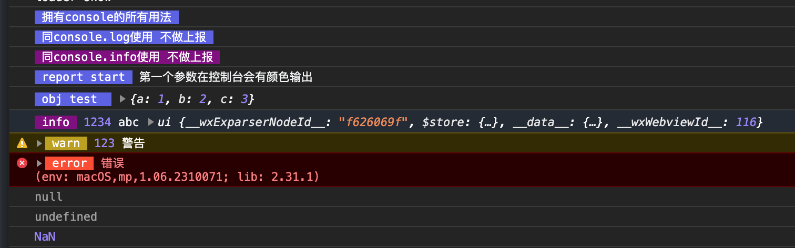
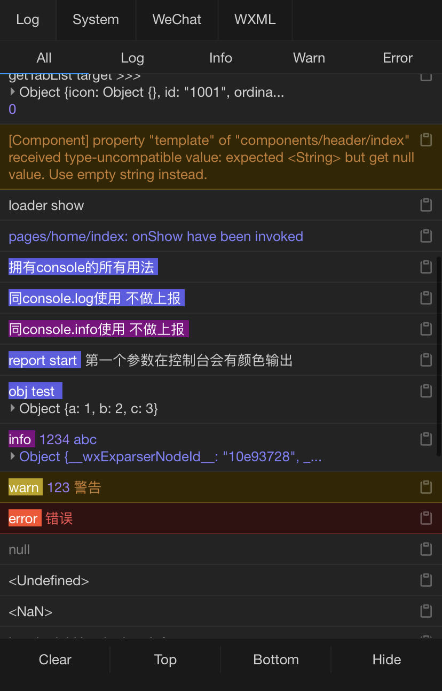
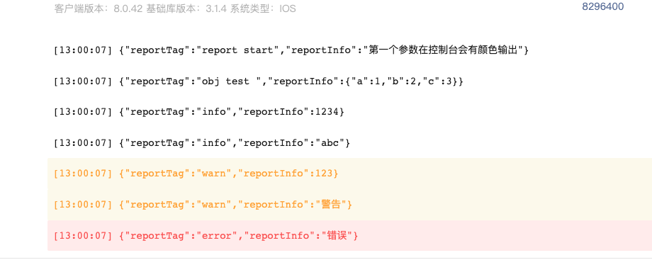

<div align="center">
  <br/>
</div>

# mini-vlog-report [Real-Time Logging for Mini Programs]

-----------------
English | [简体中文](./README.md)

## What is it?

***mini-vlog-report*** is a utility for reporting real-time logs in WeChat Mini Programs. It encapsulates the **wx.getRealtimeLogManager** method and provides an abstraction for reporting logs, while also printing logs to the local console. It optimizes the usage of the console by applying different color schemes to different types of log outputs and provides customizable styles. The logs can be viewed in the WeData section of the WeChat Mini Program backend.

> Note: The maximum length of a single log is 3000 bytes.

## How to Use

#### Installation

- npm
```shell
npm install mini-vlog-report --save
```

- pnpm
```shell
pnpm install mini-vlog-report --save
```

#### Usage

```javascript
import vLog from "mini-vlog-report";

vLog.log('All the functionalities of console.log')
vLog.log('Same as console.log, no reporting')
vLog.info('Same as console.info, no reporting')
vLog.log('report start', 'The first parameter has a color output in the console').report()
vLog.log('obj test ', {a: 1, b: 2, c: 3}).report()
vLog.info('info', 1234, 'abc', this).report()
vLog.warn('warn', 123, 'Warning').report()
vLog.error('error', 'Error').report()
vLog.log(null)
vLog.log(undefined)
vLog.log(NaN)
```

#### Example Output

<div align="center" style="display: flex">
<br/>
<br/>
<br/>
</div>

## Future Improvements

- [√] Split logs that exceed 3KB into multiple batches for submission.
- [√] Provide the ability to customize log types.
- []  Log reporting in non-WeChat applet scenarios (default platform)


Translated the above content into English.
