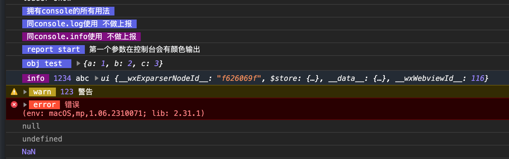

<div align="center">
  <br/>
</div>

# mini-vlog-report [小程序实时日志上报]

-----------------
简体中文 | [English](./README-EN.md)

## 这是什么？

***mini-vlog-report*** 是一个封装了 **wx.getRealtimeLogManager** 方法的小程序(微信)上报工具。将上报能力抽象封装起来，同时本地日志台打印出来。
同时优化了console的使用，将更醒目的配色配置到不同类型的日志输出上，并提供了可定制的样式能力。
上报只需要通过调用 **.report()** 方法即可实现。同时可以在微信小程序后台WeData查看上报内容。

> ps：单条日志最大长度是3000字节
>

## 如何使用

#### 装载

1. 推荐使用 ***git submodule add***的方式来载入到程序中

```shell
git submodule add git@github.com:hviwen/vlog-core.git YOUR_FILE_PATH
```
> ps: YOUR_FILE_PATH 是你的项目中的文件路径，比如：utils/vLog

#### 使用

```javascript
import vLog from "../../utils/vLog/index.js"; // 注意你的文件目录层级

vLog.log('拥有console的所有用法')
vLog.log('同console.log使用 不做上报')
vLog.info('同console.info使用 不做上报')
vLog.log('report start', '第一个参数在控制台会有颜色输出').report()
vLog.log('obj test ', {a: 1, b: 2, c: 3}).report()
vLog.info('info', 1234, 'abc', this).report()
vLog.warn('warn', 123, '警告').report()
vLog.error('error', '错误').report()
vLog.log(null)
vLog.log(undefined)
vLog.log(NaN)

```

#### 效果

<div align="center" style="display: flex">
<br/>
<br/>
<br/>
</div>

## 计划完善

- [√] 单条日志超过3k字节的拆分成多个 批次提交
- [√] 提供自定义日志类型能力


